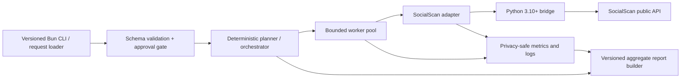

# Agent harness architecture (v1)

**Status:** Provisional architecture adopted by the TEX-30 research spike. Implementation remains subject to the approval and release gates below.

This design applies to the software-agent research tracked in https://linear.app/texas/issue/TEX-30/research-spike-agent-architecture-and-design and its parent specification, https://linear.app/texas/issue/TEX-11/create-sentient-androids. It is separate from `index.js`, which remains the interactive character-chat runtime.

## Recommended shape

The v1 entry point is a separate, non-interactive Bun CLI/harness. It accepts a versioned request, validates all limits before reading transient input, requires the applicable human confirmation, and produces an immutable run plan. The planner is **deterministic workflow planning**, not arbitrary autonomous LLM planning: it normalizes platforms, selects a named preset, chunks work, assigns retry and timeout budgets, and schedules report aggregation. It does not invent goals, platforms, credentials, or follow-up actions.

## Request flow

1. **CLI/request loader:** parse CLI flags or a local request document with `schemaVersion: 1`. Input handles remain transient and must not be copied into logs or reports.
2. **Validation and approval:** reject unknown fields, unsupported schema versions, invalid platforms, excess input, unsafe settings, or a missing live-run approval.
3. **Planner/orchestrator:** create an ordered plan from validated inputs and the selected Safe/Balanced/Fast preset. The same request and compatibility manifest produce the same plan.
4. **Bounded worker pool:** process work with a fixed concurrency ceiling. No task may create unbounded workers or recursive work.
5. **SocialScan adapter:** expose provider-neutral result and failure classifications; own compatibility checks and error normalization.
6. **Python bridge:** send one narrow JSON request to a Python 3.10+ subprocess and accept one bounded JSON response. Provider output and raw exceptions never cross the boundary.
7. **Memory/logging:** retain only run-scoped counters, durations, state transitions, and stable error codes. There is no cross-run personal-data memory in v1.
8. **Report builder:** emit a versioned aggregate report with counts, timing, preset, compatibility metadata, and failure totals—never raw handles or provider payloads.

## Concurrency, limits, and cancellation

- A single orchestrator owns a bounded queue and starts at most the preset's worker count.
- Rate limiting combines the worker ceiling with adapter-level pacing. A provider throttle signal pauses only that provider lane when possible.
- Only classified transient failures are retried. Use capped exponential backoff with jitter, honor a safe provider `Retry-After` value, and stop when the per-item retry budget is exhausted.
- Each bridge call has a hard timeout; each run has an overall deadline. Cancellation stops new dispatch, terminates active subprocesses after a short grace period, and still attempts to build a partial aggregate report marked `canceled`.
- A malformed response, crash, timeout, or rate limit affects its item/provider lane rather than the full worker pool. Configuration, preflight, report-write, and compatibility failures fail the run before live dispatch or at the report boundary.
- Queue capacity, subprocess output, request size, response size, and report size are bounded. No raw subprocess stdout/stderr is included in user-facing output.

## Failure isolation

The adapter converts subprocess and provider behavior into stable codes. A worker returns a normalized outcome instead of throwing raw provider exceptions through the orchestrator. Repeated failures can open a run-scoped provider circuit, classifying remaining checks as `unknown`/`provider_unavailable` without retry storms. Other providers continue when policy and the run deadline permit.

## Extension seams

- **Additional adapters:** implement the normalized adapter contract without changing planner semantics.
- **Report sinks:** consume only the sanitized aggregate report.
- **HTTP UI:** a status-polling transport is reserved for https://linear.app/texas/issue/TEX-34/http-ui-dashboard-required; it is not part of v1.
- **Web3:** optional, disabled-by-default SHA-256 anchoring of the sanitized report belongs after report construction under https://linear.app/texas/issue/TEX-35/web3-anchoring-hash-only-evm-attestation-optional.
- **Policy presets:** may become configuration data, but values remain bounded and versioned.

The prototype in https://github.com/Smidjehoien/void-language/pull/6 is evidence for the Bun CLI, bounded pool, retry, bridge, and aggregate-report shape. It is open, not merged or approved; these documents may ratify or revise its interfaces during review.
