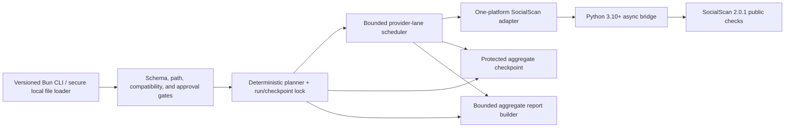

# Agent harness architecture (v1)

**Status:** Adopted research architecture for https://linear.app/texas/issue/TEX-30/research-spike-agent-architecture-and-design. Implementation and live use remain blocked by the release gates in this document and https://linear.app/texas/issue/TEX-11/create-sentient-androids.

The harness is a separate, non-interactive Bun CLI. It is not integrated into `index.js`, which remains the interactive character-chat runtime. The planner is deterministic workflow planning, not an autonomous LLM: it cannot invent goals, platforms, credentials, retries, or follow-up actions.

## Recommended shape

## Request and run flow

1. **Secure loader:** validate the versioned request and local paths. Read the operator-controlled input through a non-following secure open, validate and count values in transient memory, and calculate the resolved plan before asking for live approval. Values are never dispatched during validation or copied into logs, reports, checkpoints, approval payloads, or console output.
2. **Mode and approval gate:** the canonical request field is `executionMode: "dry-run" | "live"`. CLI flags may synthesize a request or provide ephemeral approval, but may not contradict a manifest. `--approve-live` authorizes an already-live request; it never changes execution mode and is rejected for a dry run. Fast requires a second explicit acknowledgment.
3. **Deterministic planner:** normalize the eight pinned platform IDs, select a versioned preset, and generate work in stable input-major/platform-minor order. Each planned unit is exactly `{ordinal, query, platform}`. The same validated input, compatibility manifest, and request produce the same ordinals and plan digest.
4. **Exclusive run state:** assign an opaque random run ID and acquire exclusive run/checkpoint locks before dispatch. A protected checkpoint records only schema/version metadata, preset/compatibility data, aggregate counters, and completed ordinals. It contains no queries or per-query/provider outcomes.
5. **Bounded scheduler:** dispatch one provider check per adapter call. Successful ordinals are final and are never replayed by retry or resume. Retryable failures return provider/platform identity only in transient internal state so provider-lane pacing, pause, retry-after, and circuit behavior can be applied without exposing it in persisted diagnostics.
6. **SocialScan adapter:** spawn the bridge using an already-resolved absolute Python path and an explicit minimal environment allowlist. Ambient proxy, authentication, certificate, and network credential variables are stripped. Any approved provider-scoped secret uses a dedicated secret-safe channel, never process arguments or inherited environment.
7. **Python bridge:** import `Platforms` and `execute_queries` from `socialscan.util`, then call `await execute_queries([query], [platform])` for one planned unit. Normalize only the pinned `PlatformResponse` fields and discard raw values and exceptions before returning bounded JSON.
8. **Checkpoint/report:** atomically replace protected state only through the defined checkpoint update or explicit resume/rotation rule. The final report is aggregate-only, at most 256 KiB, and includes bounded platform aggregates and phase timings.

## Pinned SocialScan boundary

The sole v1 candidate is `socialscan==2.0.1`, upstream commit/tag `7373757e616cbe5a56e1a67b9a39e3ae67bcb2a8`, with PyPI wheel SHA-256 `be3075208c6e1dc577869ed27ca37fb1ad14d95e37641fc85d5c09f307e93be3`:

- https://pypi.org/project/socialscan/2.0.1/
- https://github.com/iojw/socialscan/tree/7373757e616cbe5a56e1a67b9a39e3ae67bcb2a8

The pinned `Platforms` enum has exactly eight allowlisted members: `github`, `gitlab`, `instagram`, `pinterest`, `reddit`, `twitter`, `tumblr`, and `firefox`. Query type support differs by platform, and `execute_queries` may omit unsupported query/platform combinations. An omitted result is therefore `unknown`, not `invalid` or `available`.

The bridge inspects only `PlatformResponse.platform`, `query`, `available`, `valid`, `success`, `message`, and `link` to validate and classify the pinned shape. It must never emit the raw `query`, `message`, or `link`. A successful invalid response remains the distinct aggregate classification `invalid`; `unknown` is reserved for omitted or inconclusive outcomes. The synchronous `sync_execute_queries` wrapper calls `asyncio.run` on supported Python and must not be invoked from the bridge's running event loop.

Python 3.10+ is **our** release baseline. It is not an upstream SocialScan testing guarantee. Live execution remains blocked until hermetic fixtures pass on every supported Python 3.10+ runtime in our release matrix and a separate, explicitly approved, narrowly limited live compatibility probe succeeds.

## Retry, pacing, and attempt limits

- The retry unit is one `{ordinal, query, platform}` provider check. A retry cannot replay a successful ordinal or fan out to multiple platforms.
- Only stable transient codes are retryable. Honor bounded `Retry-After`, then apply capped exponential backoff with jitter within the run deadline.
- Each provider has a logical lane with pacing, pause, and circuit state. If the adapter cannot isolate underlying provider state, the scheduler conservatively applies the pause/circuit to all work for that provider and admits no new checks into that lane until recovery or deadline.
- `plannedUnits = actualQueryCount * platformCount` after compatibility filtering. The theoretical cap is `plannedUnits * (1 + retriesPerUnit)`; the effective `maxAttempts` is the minimum of that value, the selected preset's absolute attempt ceiling, the manifest ceiling, and what the absolute run deadline can accommodate.
- Completed ordinals are checkpointed before their transient values are discarded. Retries and resume schedule only incomplete ordinals.

## Deadlines, cancellation, and failure isolation

The harness establishes one absolute monotonic run deadline. Every phase—validation, compatibility preflight, approval wait, pacing/backoff, dispatch, bridge execution, checkpointing, report construction, and atomic report write—derives a remaining budget from it. No new attempt starts unless the remaining budget covers its attempt budget plus a 2-second cleanup/report reserve.

Cancellation stops approval waits, sleeps, backoff, and new dispatch; signals the bridge process group; waits 1 second for graceful exit; then force-kills the group. Completed ordinals are atomically checkpointed. If at least the 2-second reserve remains, the harness writes a bounded partial report marked `canceled`; otherwise it leaves the last valid checkpoint and terminates with `REPORT_WRITE_FAILED` only when report emission was required but failed. It never emits raw diagnostics.

Malformed responses, subprocess failures, timeouts, and provider throttling affect one unit or provider lane. Configuration, compatibility, approval, lock, HMAC, unsafe-path, schema, or report-write failures are run-level failures. Reports and checkpoints are constructed in bounded memory and atomically written; a failed temporary write is removed.

## Privacy-safe idempotency and resume

The checkpoint is bound to the exact normalized input and resolved plan with a keyed HMAC. The installation-local HMAC key is stored outside reports and checkpoints, for example in an OS credential store. The harness never persists an unhashed or unsalted low-entropy input digest.

`--resume` reacquires the exclusive lock, rereads the operator-controlled input, recomputes and verifies the HMAC and deterministic plan, and skips completed ordinals without replay. It retains the original preset and deadline/attempt ceilings and requires fresh live approval plus a fresh Fast acknowledgment when applicable. Missing keys, changed input or plan, stale state, concurrent duplicate runs, schema mismatch, or incompatible manifest/preset versions fail closed before dispatch. Duplicate non-resume invocation for the same active run ID is rejected; a completed run is immutable and requires explicit safe rotation/new run ID.

## Extension seams and deferrals

- New adapters must preserve one-unit retry semantics and the aggregate-only contract.
- Report sinks consume only the sanitized, bounded report.
- HTTP/status polling remains deferred to https://linear.app/texas/issue/TEX-34/http-ui-dashboard-required.
- Optional, disabled-by-default Web3 hash anchoring remains deferred to https://linear.app/texas/issue/TEX-35/web3-anchoring-hash-only-evm-attestation-optional and can occur only after sanitized report construction.
- https://github.com/Smidjehoien/void-language/pull/6 is unapproved prototype evidence only. It is not merged, releasable, or authoritative where it differs from these decisions.
